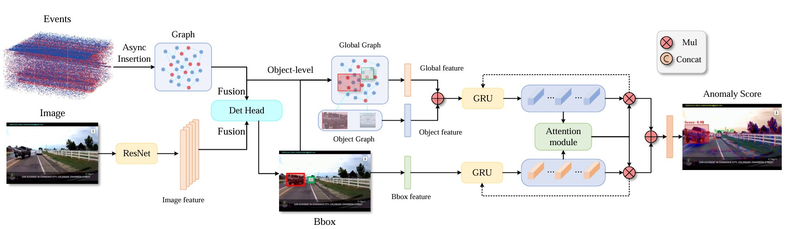

# [2025 ICML spotlight] When Every Millisecond Counts: Real-Time Anomaly Detection via the Multimodal Asynchronous Hybrid Network

Anomaly detection is essential for the safety and reliability of autonomous driving systems. Current methods often focus on detection accuracy but neglect response time, which is critical in time-sensitive driving scenarios. In this paper, we introduce real-time anomaly detection for autonomous driving, prioritizing both minimal response time and high accuracy. We propose a novel multimodal asynchronous hybrid network that combines event streams from event cameras with image data from RGB cameras. Our network utilizes the high temporal resolution of event cameras through an asynchronous Graph Neural Network and integrates it with spatial features extracted by a CNN from RGB images. This combination effectively captures both the temporal dynamics and spatial details of the driving environment, enabling swift and precise anomaly detection. Extensive experiments on benchmark datasets show that our approach outperforms existing methods in both accuracy and response time, achieving millisecond-level real-time performance.



## Installation Requirements

- Python 3.7+
- PyTorch 1.7+
- PyTorch Geometric
- NumPy
- Matplotlib
- scikit-learn
- tqdm
- h5py


## Installation

First, download the github repository and its dependencies:
```bash
WORK_DIR=/path/to/work/directory/
cd $WORK_DIR
git clone git@github.com:PKU-XD/EventAD.git
EVENTAD_DIR=$WORK_DIR/EventAD
cd $EVENTAD_DIR
```

Then start by installing the main libraries. Make sure Anaconda (or better Mamba), PyTorch, and CUDA is installed:
```bash
cd $EVENTAD_DIR
conda create -y -n EventAD python=3.8
conda activate EventAD
conda install -y setuptools==69.5.1 mkl==2024.0 pytorch==1.11.0 torchvision==0.12.0 torchaudio==0.11.0 cudatoolkit=11.3 -c pytorch
```

Then install the pytorch-geometric libraries. This may take a while:
```bash
bash install_env.sh
```

The above bash file will figure out the CUDA and Torch version, and install the appropriate pytorch-geometric packages. Then, download and install additional dependencies locally:
```bash
bash download_and_install_dependencies.sh
conda install -y h5py blosc-hdf5-plugin
```

Install the dagr package:
```bash
pip install -e .
```

Install all remaining packages:
```bash
pip install -r requirements.txt
```

## Data Preparation
Download the dataset first.
### ROL Dataset
> * Dataset : [Download](https://drive.google.com/drive/folders/164J2F4aI4DpZEEgIUZlvabOMVxWxP2O9?usp=sharing)  
> * CNN Feature : [Download](https://drive.google.com/drive/folders/1V5BoyF8QJOxjoPwSDYKuAO8r76gpPg8v?usp=sharing)

### DoTA Dataset
> * Dataset : [Download](https://drive.google.com/drive/folders/1_WzhwZC2NIpzZIpX7YCvapq66rtBc67n)  
> * Github : [DoTA](https://github.com/MoonBlvd/Detection-of-Traffic-Anomaly)

### Dataset Structure
Organize the dataset into the data folder.

```
project-root/
├── data/
│   ├── detector/
│   │   ├── ROL/
│   │   │   ├── train/
│   │   │   │   └── video_name/
│   │   │   │       ├── events/
│   │   │   │       │   ├── events.h5
│   │   │   │       │   └── events_2x.h5
│   │   │   │       ├── images/
│   │   │   │       │   ├── left/
│   │   │   │       │   │   └── distorted/
│   │   │   │       │   │       ├── 000000.png
│   │   │   │       │   │       ├── 000001.png
│   │   │   │       │   │       └── ...
│   │   │   │       │   └── timestamps.txt
│   │   │   │       └── object_detections/
│   │   │   │           └── left/
│   │   │   │               └── tracks.npy
│   │   │   └── val/
│   │   │       └── ... (same as train structure)
│   │   └── DoTA/
│   │       ├── train/
│   │       │   └── video_name/
│   │       │       ├── events/
│   │       │       │   ├── events.h5
│   │       │       │   └── events_2x.h5
│   │       │       ├── images/
│   │       │       │   ├── left/
│   │       │       │   │   └── distorted/
│   │       │       │   │       ├── 000000.png
│   │       │       │   │       ├── 000001.png
│   │       │       │   │       └── ...
│   │       │       │   └── timestamps.txt
│   │       │       └── object_detections/
│   │       │           └── left/
│   │       │               └── tracks.npy
│   │       └── val/
│   │           └── ... (same as train structure)
│   ├── video/
│   │   ├── ROL/
│   │   │   ├── train/
│   │   │   │   └── video_name.mp4
│   │   │   └── val/
│   │   │       └── video_name.mp4
│   │   └── DoTA/
│   │       ├── train/
│   │       │   └── video_name.mp4
│   │       └── val/
│   │           └── video_name.mp4
├── train.py
├── test.py
└── README.md
```


### Event Generation

Refer to [v2e](https://github.com/SensorsINI/v2e) official documentation to generate events from videos. After configuring the v2e file, run the `v2e.py` file. Run the `v2e.py` code in batches and use the following script to generate event data for each video, i.e. h5 files:

```bash
python scripts/v2e.py
```

Downsample all h5 file event data to get `events_2x.h5` file:

```bash
bash scripts/downsample_all_events.sh
```

### Generate RGB Images
Generate each video frame:
```bash
python scripts/video2rgb.py
```

### Alignment
Generate `timestamps.txt` to align RGB frames with event stream timestamps:
```bash
python scripts/timestamps.py
```

### Generate Object Detections
Package bbox and anomaly categories into `tracks.npy`:
```bash
python scripts/track.py
```

### others
Get the toa value of each video:
```bash
python scripts/extract_toa_value.py
```

Get the distinction between the training set and the validation set of the data set:
```bash
python scripts/generate_yaml.py
```
Set the dataset path in the `eventad_config.py` parameter `--dataset_directory` `'./data/detector/ROL'`

## Training
First you need to download the dagr model file from [dagr](https://download.ifi.uzh.ch/rpg/dagr/data/dagr_s_50.pth) and put it in the `./checkpoints/detector/dagr_s_50.pth` folder. Modify the `--checkpoint` in `eventad_config.py` to the path of the dagr model. Then, run the following command to train the model:
```bash
python train.py
```
After training, you will get the best model file in the folder `'output/models'`.

## Test
The model file that we trained to achieve the best performance on the ROL dataset is available here [best_rol](https://drive.google.com/file/d/18hw3UjG1PgbU9kNmQrtOHOEGkAMVVA4a/view?usp=drive_link). Setting up the model file for testing:
```bash
python test.py --measure_fps --test_checkpoint './checkpoints/detector/best_rol.pth'
```
